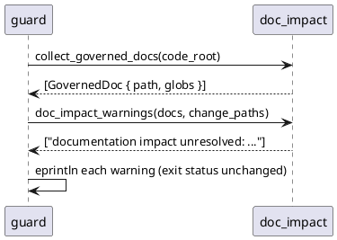

# Doc Impact Guard Implementation Plan

> `spec.md` is authoritative. This plan may choose an implementation but must not redefine the contract.

## Approach

New small module `src/doc_impact.rs` with three pure pieces plus one guard
hook — no new dependencies, no persisted state:

1. `parse_governs_markers(content) -> Vec<String>` — scan lines for
   `<!-- agent-spec:governs: ... -->`, split globs on commas, accumulate
   across multiple marker lines.
2. `collect_governed_docs(code_root) -> Vec<GovernedDoc>` — read `*.md` at
   the root and `docs/**/*.md` recursively; keep files with at least one glob.
3. `doc_impact_warnings(docs, changes) -> Vec<String>` — the join: for each
   doc, if any normalized change matches a governs glob and the doc's own
   path is not in the change set, emit one warning naming the doc and the
   first matching path.
4. `cmd_guard` calls 2+3 after spec checks and prints warnings to stderr;
   the `errors` vector is untouched, so exit status cannot change.

## Affected Interfaces

- `src/doc_impact.rs` (new module, unit-tested)
- `src/main.rs` — `mod doc_impact;` + guard hook (a few lines)
- `src/spec_verify/boundaries.rs` — expose `path_matches_pattern` as
  `pub(crate)` for reuse (no behavior change)
- `README.md` — documents the marker and dogfoods it with
  `<!-- agent-spec:governs: src/main.rs -->`

## Data and Control Flow

## Compatibility and Migration

None needed: repos without markers see zero new output; the check is
warning-only by contract, so no existing gate can start failing.

## Test Strategy

- Scenarios 1-4 → unit tests in `src/doc_impact.rs` (pure functions; a
  tempdir only for discovery).
- Scenario 5 → black-box E2E in `tests/doc_impact_guard_e2e.rs`: run the
  compiled binary with a governed doc + passing spec + explicit `--change`,
  assert stderr text and exit 0.

## Risks

- False-positive nagging on wide globs → mitigated by contract decision:
  warning-level only in this phase; escalation/ack deferred until noise
  rates are observed in real use.
- Recursive `docs/**` scan cost on huge repos → bounded: only `.md` files
  are read, line-prefix scan only, no parsing.
