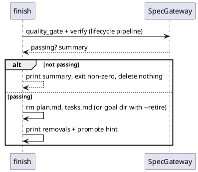

# Finish Command Implementation Plan

> `spec.md` is authoritative. This plan may choose an implementation but must not redefine the contract.

## Approach

One new clap subcommand in `src/main.rs` reusing the lifecycle machinery:

1. `Finish { spec, code, retire, min_score }` — mirror lifecycle's args.
2. `cmd_finish`: load `SpecGateway`, run `quality_gate` + `verify` exactly
   like `cmd_lifecycle`'s pipeline; abort with the non-passing summary on
   any failure (no filesystem writes before this point).
3. On success: for `plan.md` / `tasks.md` siblings of the spec file, delete
   and print each; with `--retire`, remove the spec's parent directory
   instead (refuse if the spec is not inside a goal-shaped directory —
   i.e. its basename is not `spec.md` — to avoid deleting `specs/`).
4. Promote hint: count Rules in the resolved spec; if >0, print
   `next: agent-spec promote` with the count.

## Affected Interfaces

- `src/main.rs` — subcommand + `cmd_finish` (+ unit-testable
  `finish_cleanup_actions` helper if extraction stays cheap)
- `tests/finish_cli_e2e.rs` — four black-box scenarios, using report-mode
  specs (test_command writes a JUnit file) so temp workspaces verify
  cheaply without cargo projects

## Data and Control Flow

## Compatibility and Migration

New command only; no existing behavior changes.

## Test Strategy

All four scenarios are public CLI E2E (the contract treats black-box
evidence as primary). Failing-contract fixture: report-mode spec whose
JUnit report marks a testcase failed.

## Risks

- Deleting the wrong directory with --retire → guarded by the
  `spec.md`-basename check and E2E coverage.
- Verification cost inside temp workspaces → avoided via report-mode
  fixtures (printf a JUnit file, no cargo).
