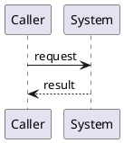

# Integrate Command Implementation Plan

> `spec.md` is authoritative. This plan may choose an implementation but must not redefine the contract.

## Approach

Describe the smallest implementation that satisfies the contract.

## Affected Interfaces

- List code, APIs, storage, and documentation boundaries.

## Data and Control Flow

## Compatibility and Migration

Describe compatibility requirements or state that none are needed.

## Test Strategy

Map every Scenario in `spec.md` to public E2E evidence; add focused lower-level tests only where useful.

## Risks

- List concrete risks and mitigations.
