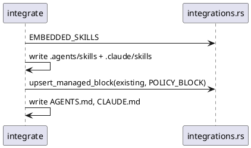

# Integrate Command Implementation Plan

> `spec.md` is authoritative. This plan may choose an implementation but must not redefine the contract.

## Approach

- Canonical policy block + marker constants + `upsert_managed_block` in
  `spec_report/integrations.rs`, next to the existing integration bodies.
- Skills embedded at compile time (`include_str!`) as `EMBEDDED_SKILLS`,
  written to `.agents/skills/` and `.claude/skills/` with overwrite
  semantics so re-running integrate upgrades them.
- `cmd_integrate` in main.rs: validate target dir, install skills, upsert
  blocks into AGENTS.md and CLAUDE.md.
- `detect_test_binding` in main.rs: package.json without Cargo.toml →
  vitest JUnit frontmatter lines injected via a `{binding}` placeholder in
  the SDD spec template.

## Affected Interfaces

- src/spec_report/integrations.rs (constants + upsert + embedded skills)
- src/main.rs (Integrate subcommand, cmd_integrate, detect_test_binding,
  generate_sdd_spec_with_binding)
- tests/integrate_cli_e2e.rs (five black-box scenarios)

## Data and Control Flow

## Compatibility and Migration

Purely additive command. Existing AGENTS.md/CLAUDE.md content outside the
markers is preserved byte-for-byte.

## Test Strategy

Prose-only guarantee and upsert semantics as unit tests beside the
constants; everything user-visible as public CLI E2E in
tests/integrate_cli_e2e.rs.

## Risks

- Skill drift between repo copies and embedded copies → embedded content
  IS the repo copy (include_str! at build time).
- Marker collision with user content → full marker strings are unlikely
  literals; replace happens only when both markers are present in order.
