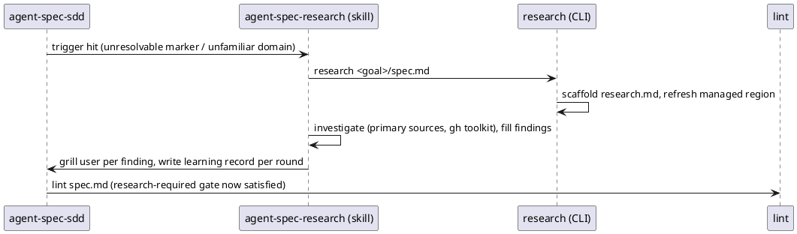

# Research and Learn Implementation Plan

> `spec.md` is authoritative. This plan may choose an implementation but must not redefine the contract.
> Codebase context below generated via `agent-spec plan --out` (dogfooded), then curated.

## Approach

Four slices, in dependency order:

1. **CLI `research`** (src/main.rs): `research <goal-spec> --code .` —
   create sibling research.md from an embedded template on first run;
   every run refreshes the codebase-state managed region using
   `build_plan_context` + a new codebase-only formatter in plan.rs.
2. **Three lints** (src/spec_lint/linters.rs): `research-required`
   (Error — unresolved bracketed marker + no sibling research.md, message
   names the research command), `research-uncited` (Warning — sibling
   exists but Current State/Decisions never mention research.md),
   `research-unfilled` (Warning — sibling still contains the template's
   `[UNFILLED` placeholders). Sibling = source_path.parent()/research.md.
3. **Skill linkage** (Pocock composition model): new
   `skills/agent-spec-research/SKILL.md` (investigation methodology +
   grill protocol + immediate learning records); agent-spec-sdd workflow
   inserts "research and learn" step invoking it by name;
   authoring/tool-first gain one-line cross-references; integrations.rs
   EMBEDDED_SKILLS += research skill; install-skills.sh list += 1.
4. **finish consumables** (src/main.rs): removal list gains research.md
   and the learning-records/ directory.

## Affected Interfaces

From the generated scan (24 files in boundaries): src/spec_lint/linters.rs
(+3 linters, pipeline registration), src/main.rs (Research subcommand,
template const, finish list), src/spec_gateway/plan.rs (codebase-only
formatter — already landed), src/spec_report/integrations.rs (embedded
skill), skills/** + .claude/skills/** (new skill + 3 cross-referenced
edits), tests/** (research_cli_e2e.rs new; one test each appended to
integrate/finish e2e files; lint unit tests beside existing
needs-clarification tests).

## Data and Control Flow

## Compatibility and Migration

Additive. Specs without markers and without research.md see zero change.
The research-required error only fires where needs-clarification already
blocks the gate today, so no currently-green spec turns red.

## Test Strategy

Contract's seven scenarios: two new E2E (research scaffold/refresh), one
E2E appended to each of integrate and finish suites, three lint unit
tests placed beside the existing needs-clarification tests (reusing their
marker fixtures).

## Risks

- Sibling lookup needs source_path: lints only fire for disk-parsed specs
  (from_str parses leave source_path empty) — acceptable, gates run on
  files.
- research-required may fire when a marker was resolvable by reading code
  (machine cannot judge resolvability) — accepted knowingly at Grill 5/5.
